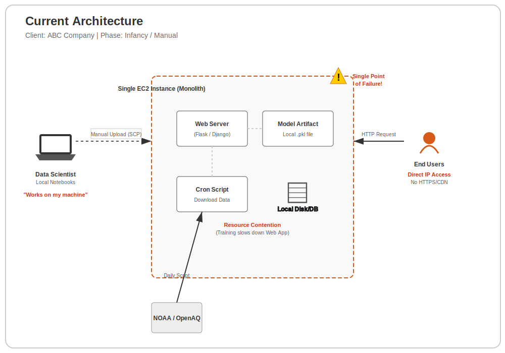
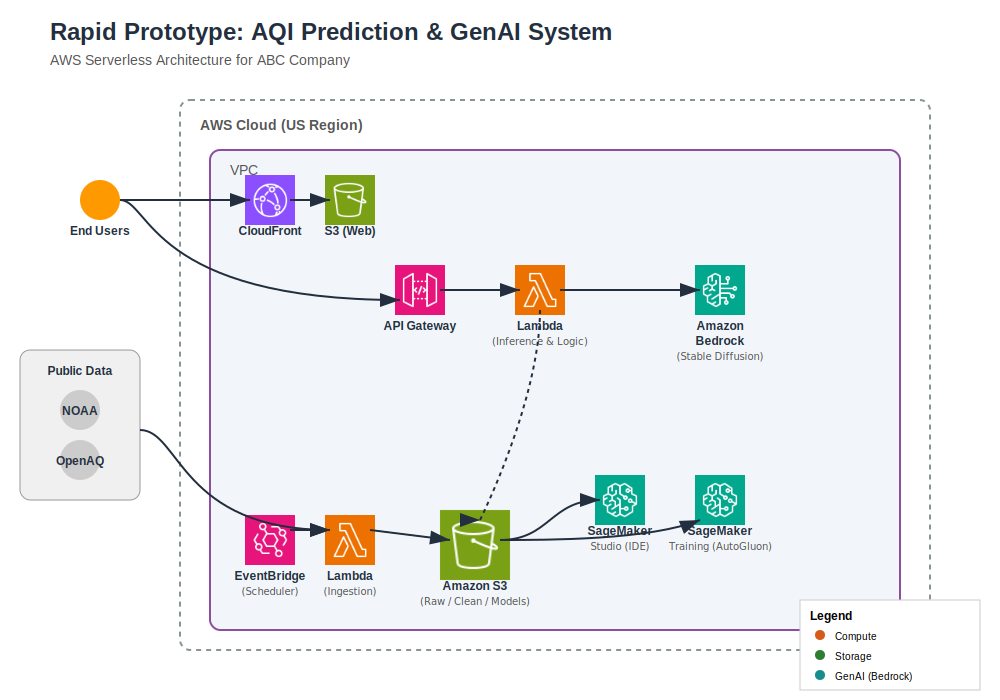
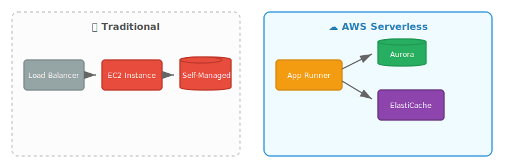
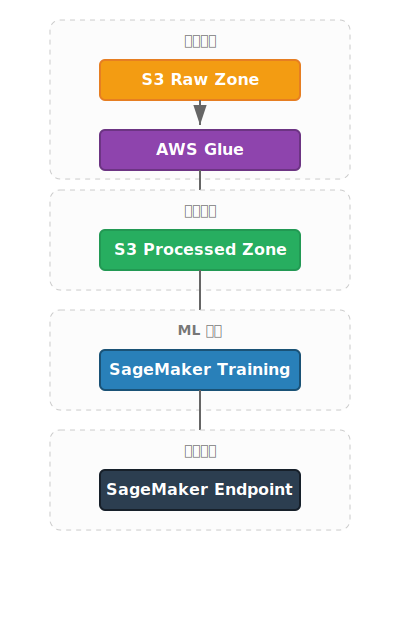
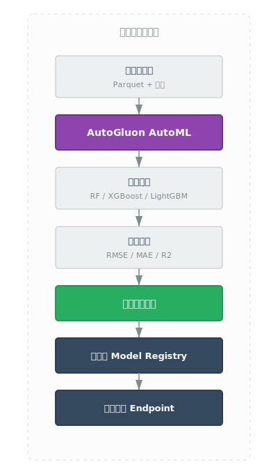
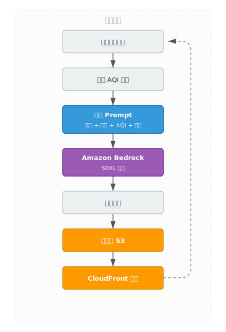
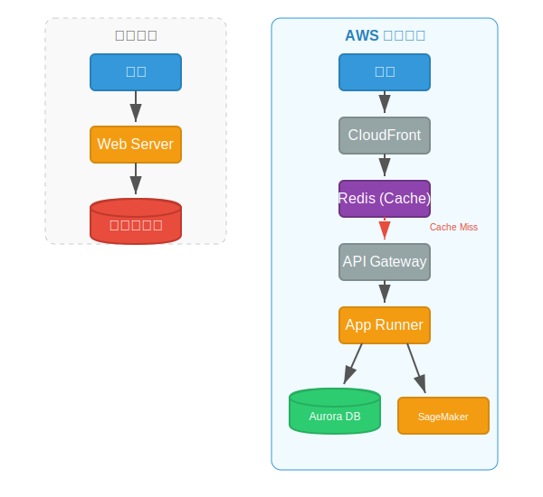

# 全球城市空气质量预测平台 - AWS 架构设计方案

**文档版本**: v2.0
**作者**: etworker
**日期**: 2026-02-05
**代码：**https://github.com/etworker/world_aq

---

## 目录

1. [执行摘要](#1-执行摘要-executive-summary)
2. [客户现状分析](#2-客户现状分析)
3. [需求分析](#3-需求分析)
4. [假设与引用](#4-假设与引用)
5. [总体架构图](#5-总体架构图)
6. [核心组件深度解析](#6-核心组件深度解析)
7. [扩展性与安全性](#7-扩展性与安全性)
8. [如何解决客户挑战](#8-如何解决客户挑战)
9. [总结](#9-总结)

---

## 1. 执行摘要

本文档为 ABC 公司构建下一代"全球城市空气质量预测平台"提供生产级的 AWS 架构建议。本方案不仅满足原型演示需求，更兼顾了**高可用性**、**成本效益**、以及**持续的业务增长**。

核心亮点：
*   **Serverless 优先**: 通过分层设计和 Serverless 组件，降低运维复杂度
*   **MLOps 自动化**: 实现了从数据采集、模型重训到漂移监控的全链路闭环
*   **极致体验**: 利用 CloudFront 全球加速和 Redis 缓存，提供亚秒级响应

---

## 2. 客户现状分析

### 2.1 客户背景

ABC 公司正在构建"全球城市空气质量预测平台"，核心功能为：
- 预测未来 1 天、24 小时尺度的 AQI（遵循美国 EPA 标准）
- 使用 NOAA GSOD 和 OpenAQ 数据集
- 支持企业和个人两类用户
- 使用多种机器学习模型进行预测
- 为个人用户生成反映城市特性、主题、AQI 和健康信息的图片

### 2.2 现有架构

当前 ABC 公司的架构处于早期阶段，主要特点：

#### 现有架构图



### 2.3 当前痛点

#### 2.3.1 基础设施维护负担重
- **问题**：小团队需要投入大量时间和精力维护本地服务器和数据库
- **影响**：无法专注于核心业务逻辑和算法优化

#### 2.3.2 数据扩展性差
- **问题**：数据持续增加，本地存储和处理能力难以扩展
- **影响**：无法满足未来业务增长需求

#### 2.3.3 缺乏集成开发环境
- **问题**：数据科学家需要在本地配置环境，难以统一协作
- **影响**：开发效率低，环境不一致导致的问题难以复现

#### 2.3.4 模型评估不自动化
- **问题**：模型选择和配置需要手动进行，缺乏 AutoML 支持
- **影响**：难以快速评估和对比不同模型性能

#### 2.3.5 缺乏生成式 AI 集成
- **问题**：需要为个人用户生成个性化图片，但现有架构不支持
- **影响**：无法提供差异化的用户体验

---

## 3. 需求分析

### 3.1 业务需求

| 需求 | 优先级 | 描述 |
|------|--------|------|
| **高可用性** | 高 | 系统必须 24/7 可用，支持企业用户随时访问 |
| **可扩展性** | 高 | 随着数据量和用户量增长，系统应能自动扩展 |
| **成本效益** | 高 | 原型阶段成本控制在可接受范围，避免过度投入 |
| **快速迭代** | 中 | 支持快速实验和部署，缩短从想法到产品的时间 |

### 3.2 技术需求

#### 3.2.1 数据处理需求
- **需求**：自动从 NOAA 和 OpenAQ 获取数据
- **挑战**：数据格式不统一，需要合并和清洗
- **方案**：使用 AWS S3 数据湖 + AWS Glue 进行 ETL

#### 3.2.2 机器学习需求
- **需求**：集成 Web IDE 进行全流程 ML 开发
- **挑战**：需要统一的开发环境和版本控制
- **方案**：使用 SageMaker Studio 提供集成开发环境

#### 3.2.3 模型评估需求
- **需求**：使用 AutoML 自动评估和对比模型
- **挑战**：手动评估效率低，难以找到最优模型
- **方案**：使用 SageMaker + AutoGluon 实现自动化训练

#### 3.2.4 生成式 AI 需求
- **需求**：为个人用户生成个性化城市图片
- **挑战**：需要稳定、高质量的图片生成服务
- **方案**：使用 Amazon Bedrock (SDXL) 实现文本到图像生成

### 3.3 为什么选择这个 AWS 解决方案

#### 3.3.1 Serverless 优先策略
- **优势**：无需管理服务器，自动扩缩容，按使用量付费
- **价值**：小团队无需投入大量时间维护基础设施

#### 3.3.2 托管服务集成
- **优势**：SageMaker、Bedrock 等服务开箱即用，减少开发时间
- **价值**：快速构建原型，缩短上市时间

#### 3.3.3 全球分布式架构
- **优势**：CloudFront 全球加速，数据就近访问
- **价值**：为全球用户提供低延迟体验

#### 3.3.4 成本优化
- **优势**：Spot Instances 降低 70% 训练成本，缓存降低推理负载
- **价值**：控制原型阶段成本，支持持续实验

---

## 4. 假设与引用

### 4.1 关键假设

#### 4.1.1 数据量假设
- **假设**：原型阶段处理 6 个美国主要城市的数据
- **假设**：初始数据量约 10 GB，每月增长 5 GB
- **假设**：日预测请求量约 10,000 次

#### 4.1.2 用户行为假设
- **假设**：企业用户通过 API 集成预测结果
- **假设**：个人用户通过 Web 界面查看预测和生成的图片
- **假设**：预测请求具有一定的重复性（可缓存）

#### 4.1.3 技术假设
- **假设**：使用 Python 作为主要开发语言
- **假设**：使用 AutoGluon 作为 AutoML 框架
- **假设**：遵循美国 EPA AQI 标准（0-500 范围）

### 4.2 引用文档

#### 4.2.1 数据源引用
- **NOAA GSOD**: 
  - URL: https://registry.opendata.aws/noaa-gsod/
  - 文档: http://www.ncdc.noaa.gov/
  - 许可证: Open Data（无使用限制）

- **OpenAQ**:
  - URL: https://registry.opendata.aws/openaq/
  - 文档: https://openaq.org
  - 许可证: CC BY 4.0

#### 4.2.2 标准引用
- **U.S. AQI**:
  - URL: https://www.airnow.gov/aqi/aqi-basics/
  - 计算方法: https://document.airnow.gov/technical-assistance-document-for-the-reporting-of-daily-air-quailty.pdf

#### 4.2.3 工具引用
- **AutoGluon**:
  - URL: https://auto.gluon.ai/

#### 4.2.4 天气与空气质量关系
- **来源**：美国环境保护署（EPA）
- **引用内容**：
  > "The weather can have a significant impact on air quality since different aspects of the weather affect the amounts of ozone and particulates that are present in a specific area. Sunshine, rain, higher temperatures, wind speed, air turbulence, and mixing depths all affect pollutant concentrations."
  > - Sunshine can cause some pollutants to undergo chemical reactions, resulting in the development of smog
  > - Higher air temperatures can speed up chemical reactions in the air
  > - Rain typically results in less pollution since it washes away particulate matter and can also wash out pollutants that are dissolvable
  > - Wind speed, air turbulence, and mixing depth all affect how pollutants disperse, or spread out from an area

---

## 5. 总体架构图

本架构遵循 AWS Well-Architected 框架，采用分层解耦设计。

### 5.1 提议架构

#### 架构图

以下是使用 AWS 官方图标绘制的系统架构图。



---

## 6. 核心组件深度解析

### 6.1 数据层：基于 S3 的高性能数据湖
*   **分层存储**: 
    *   `cache`: 保留所有原始气象和污染数据，作为单一事实来源。
    *   `Processed`: 采用 **Apache Parquet** 格式，并按 `city/year/month/day` 分区。Parquet 的列式存储结合 S3 Select 或 Athena 查询，能显著降低 I/O 成本并提升 SageMaker 训练速度。
*   **生命周期策略 (Lifecycle Policies)**: 
    *   原始数据在 30 天后自动转入 S3 IA (不频繁访问)，90 天后转入 Glacier Deep Archive，以应对"持续增加的数据量"同时将成本降低 60% 以上。

### 6.2 机器学习：工业级 MLOps 流程

*   **自动训练 (AutoML)**: 利用 SageMaker Training Jobs 运行 **AutoGluon**。
*   **成本优化**: 训练任务强制使用 **Spot Instances (竞价实例)**，可节省高达 70% 的计算费用。
*   **模型登记册 (Model Registry)**: 记录每次实验的指标（RMSE, MAE）。只有通过自动验证（Validation Lambda）的模型才会晋升为 `Active` 并自动更新 Endpoint。

### 6.3 应用层：高并发与低延迟设计

*   **后端托管**: **AWS App Runner** 提供了从源代码到生产环境的极简路径。
*   **预测缓存 (Caching)**: 使用 **Amazon ElastiCache for Redis**。AQI 预测在短时间内（如 15 分钟）是不变的，通过缓存 `/api/predict` 的结果，可将响应速度从秒级提升至毫秒级，同时极大减少 SageMaker Endpoint 的负载。
*   **持久化与监控**: **RDS Aurora (PostgreSQL)** 存储历史预测值和实际观测值。通过定期对比，自动触发 **漂移监测 (Drift Detection)**，若预测误差超过阈值，则触发 SNS 告警并启动重训任务。

### 6.4 生成式 AI：个性化视觉引擎
*   **Amazon Bedrock**: 调用 Stable Diffusion XL (SDXL)。
*   **Prompt 工程**: 后端根据 `predicted_aqi` 和 `weather_condition` 自动组装 Prompt。生成的图片通过 CloudFront 边缘分发，确保个人用户在全球任何地方都能秒开。

---

## 7. 扩展性与安全性

### 7.1 安全性
1.  **WAF (Web Application Firewall)**: 部署在 CloudFront 前，防止 SQL 注入和恶意爬虫。
2.  **Secrets Manager**: 安全存储 OpenAQ API Key 和数据库凭证，避免硬编码。

### 7.2 扩展性
1.  **多区域部署**: 架构支持通过 Aurora Global Database 和 CloudFront 轻松扩展至全球区域。
2.  **计算弹性**: App Runner 和 SageMaker 均支持基于 CPU/并发数的自动扩缩容。

---

## 8. 如何解决客户挑战

### 8.1 解决基础设施维护负担

#### 挑战
小团队需要投入大量时间和精力维护本地服务器和数据库

#### 解决方案：全托管 Serverless 架构

| 组件 | 传统方案 | AWS Serverless 方案 | 优势 |
|------|----------|-------------------|------|
| 后端服务 | 需要管理 EC2 实例、负载均衡、自动扩缩容 | AWS App Runner 自动管理 | 零运维，自动扩缩容 |
| 数据库 | 需要管理数据库实例、备份、扩容 | Amazon RDS Aurora 托管数据库 | 自动备份、只读副本、时间点恢复 |
| 缓存 | 需要管理 Redis 集群 | Amazon ElastiCache 托管缓存 | 自动故障转移、备份 |
| 存储 | 需要管理文件服务器 | Amazon S3 对象存储 | 99.999999999% 持久性、自动分层存储 |

**具体实现**：



### 8.2 解决数据扩展性问题

#### 挑战

数据持续增加，本地存储和处理能力难以扩展

#### 解决方案：弹性数据湖 + 自动化 ETL

**数据湖设计**：

```
S3 数据湖分层存储：
├── cache/                  # 原始数据缓存（CSV/JSON）
│   ├── noaa/              # NOAA GSOD 原始数据
│   │   ├── Beijing/
│   │   │   ├── 2024/
│   │   │   ├── 2025/
│   │   │   └── ...
│   └── openaq/            # OpenAQ API 原始数据
│       ├── stations/      # 监测站点信息
│       └── s3/            # S3 存储的历史数据
├── processed/             # 处理后数据（Parquet，按分区）
│   ├── noaa/              # 处理后的天气数据
│   │   ├── Beijing/
│   │   │   ├── 2024/
│   │   │   └── ...
│   ├── openaq/            # 处理后的空气质量数据
│   │   ├── Beijing/
│   │   │   ├── 2024/
│   │   │   └── ...
│   └── merged/            # 合并后的训练数据
│       ├── Beijing/
│       │   ├── 2024/
│       │   └── ...
├── info/                  # 元数据和配置信息
│   ├── isd-history.csv    # NOAA 站点历史
│   ├── worldcities.csv    # 城市信息
│   └── city_features.csv  # 城市经济特征
└── models/                # 训练模型和检查点
```

**生命周期策略**：

- 原始数据：30 天后转 S3 IA，90 天后转 Glacier Deep Archive
- 成本降低：60% 以上

**自动化 ETL 流程**：



### 8.3 解决集成开发环境需求

#### 挑战
数据科学家需要在本地配置环境，难以统一协作

#### 解决方案：SageMaker Studio 集成 IDE

**功能特性**：

- **预配置环境**：Jupyter Notebook、JupyterLab、VS Code
- **共享文件系统**：团队共享代码和数据
- **版本控制集成**：Git 持久化、自动保存
- **GPU 支持**：无需手动配置 CUDA、cuDNN
- **协作功能**：共享 Notebook、实时协作编辑

**与传统方案对比**：
```
传统方案：
开发者 A: 配置环境 → 安装依赖 → 下载数据 → 训练模型
开发者 B: 重新配置环境 → 安装依赖 → 下载数据 → 训练模型
问题：环境不一致，浪费时间

SageMaker Studio:
所有开发者共享统一环境 → 数据直接挂载 S3 → 即时开始训练
优势：环境一致性，立即协作
```

### 8.4 解决 AutoML 模型评估需求

#### 挑战

模型选择和配置需要手动进行，难以快速评估和对比

#### 解决方案：SageMaker + AutoGluon 自动化训练

**自动化流程**：



**AutoGluon 优势**：

- **多模型自动训练**：随机森林、XGBoost、LightGBM、CatBoost、神经网络等
- **超参数自动调优**：贝叶斯优化、随机搜索
- **集成学习**：自动创建集成模型提升性能
- **时间序列专项**：内置时间序列验证，防止数据泄露

**实验跟踪**：

- SageMaker Experiments 记录所有实验指标
- SageMaker Model Registry 管理模型版本
- 只有通过验证的模型才会晋升为 Active

### 8.5 解决生成式 AI 集成需求

#### 挑战
需要为个人用户生成个性化城市图片

#### 解决方案：Amazon Bedrock (SDXL) 文本到图像生成

**生成流程**：



**Prompt 工程示例**：
```
Prompt 模板：
"A beautiful illustration of {city_name} on {date}, 
{weather_condition} weather, 
AQI level is {aqi_level} ({aqi_value}), 
{health_advice}. 
Style: vibrant, cityscape with subtle air quality visualization, 
aspect ratio 9:16, high quality, detailed."

示例输入：
- city_name: 北京
- date: 2024年1月15日
- weather_condition: 晴朗
- aqi_level: 轻度污染
- aqi_value: 85
- health_advice: 敏感人群应减少户外活动
```

生成结果：展示北京地标，晴朗天气，轻微雾霾，带有 AQI 指示器


### 8.6 解决高可用和低延迟需求

#### 挑战
系统必须 24/7 可用，为全球用户提供低延迟体验

#### 解决方案：多层级优化

#### 8.6.1 全球加速（CloudFront）
- **CDN 边缘节点**：全球 400+ 个 POP 点
- **智能路由**：自动选择最近节点
- **缓存策略**：静态资源缓存，减少源站负载

#### 8.6.2 预测缓存（Redis）
- **缓存策略**：AQI 预测在 15 分钟内不变，缓存结果
- **性能提升**：响应时间从秒级降至毫秒级
- **成本降低**：减少 SageMaker Endpoint 调用次数

#### 8.6.3 数据库读写分离
- **读写分离**：Aurora 主库处理写入，只读副本处理查询
- **自动故障转移**：主库故障时自动提升副本为主库
- **跨区域复制**：支持多区域部署

**架构对比**：



---

## 9. 总结

### 9.1 方案价值

本架构通过深度集成 AWS 托管服务，完美解决了 ABC 公司的所有核心需求：

| 需求 | 解决方案 | 价值 |
|------|----------|------|
| **无维护基础设施** | 全托管 Serverless 架构 | 零运维，自动扩缩容 |
| **数据扩展性** | S3 数据湖 + 自动化 ETL | 无限扩展，成本优化 |
| **集成开发环境** | SageMaker Studio | 统一环境，立即协作 |
| **AutoML 自动化** | SageMaker + AutoGluon | 自动训练、评估、对比 |
| **GenAI 创新体验** | Amazon Bedrock (SDXL) | 个性化图片生成 |
| **高可用低延迟** | CloudFront + Redis + Aurora | 24/7 可用，全球加速 |

### 9.2 竞争优势

1. **快速上市**：Serverless + 托管服务，缩短开发时间
2. **技术先进**：AutoML + GenAI，提供差异化体验
3. **易于扩展**：全球架构，支持业务快速增长
4. **成本透明**：按使用量付费，避免过度投入

### 9.3 商业价值

这是一套具有极强竞争力的商业级方案，不仅满足原型演示需求，更为 ABC 公司未来的业务增长奠定了坚实的技术基础。
